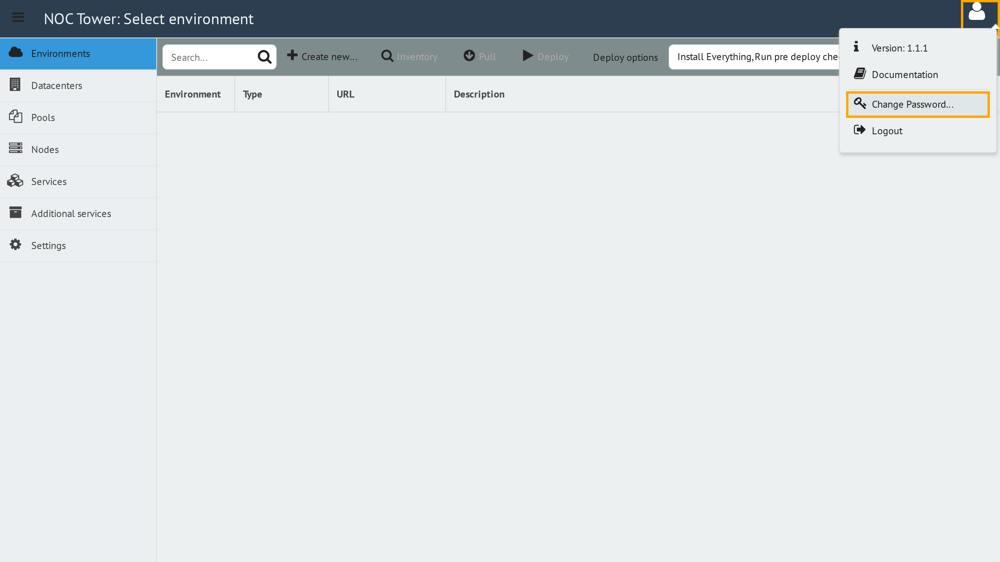
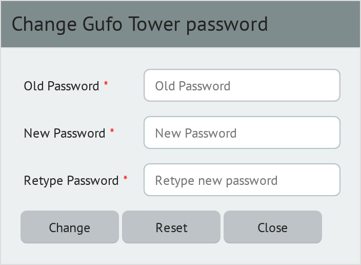

# Changing Password

To change your password, hover over the user icon in the top-right corner of the header and select **Change Password...** from the user menu.

The **Change Password** form will appear.

The form contains three fields:

* **Old Password** — your current password.
* **New Password** — the new password you want to use.
* **Retype Password** — the new password entered again for confirmation.

To change your password:

1. Enter your current password in **Old Password**.
2. Enter your new password in **New Password**.
3. Enter the same new password in **Retype Password**.
4. Click **Change**.

If the password is changed successfully, the form closes and you return to the main desktop.

### Resetting the Form

Click **Reset** to clear all password fields and start over.

### Canceling the Password Change

Click **Close** to close the form without changing your password. You will return to the main desktop.