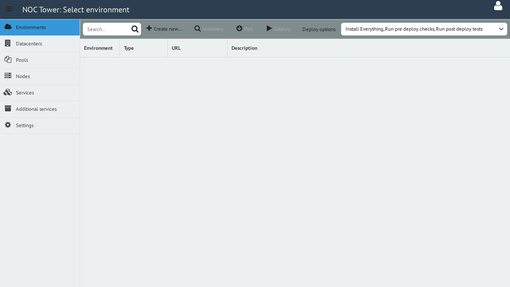
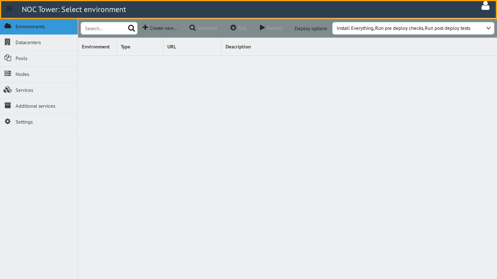
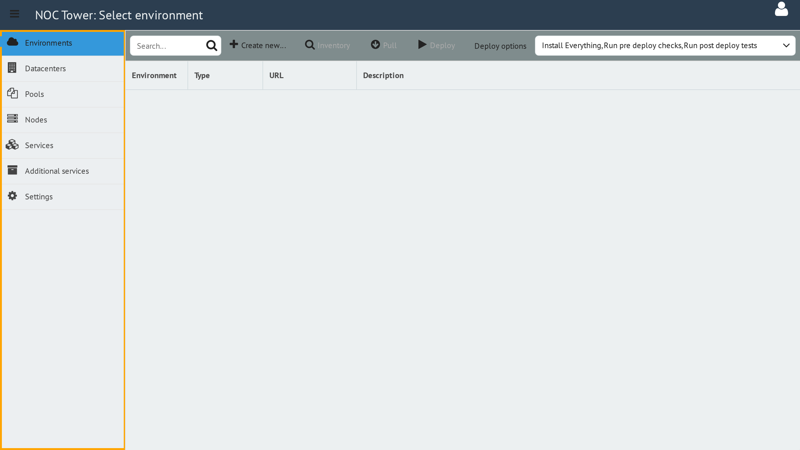
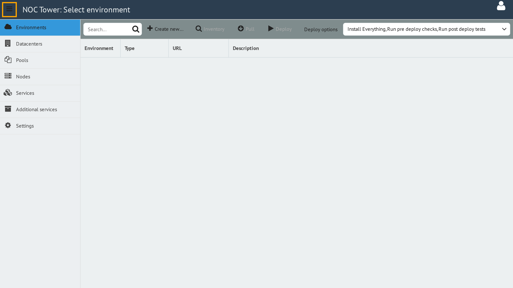
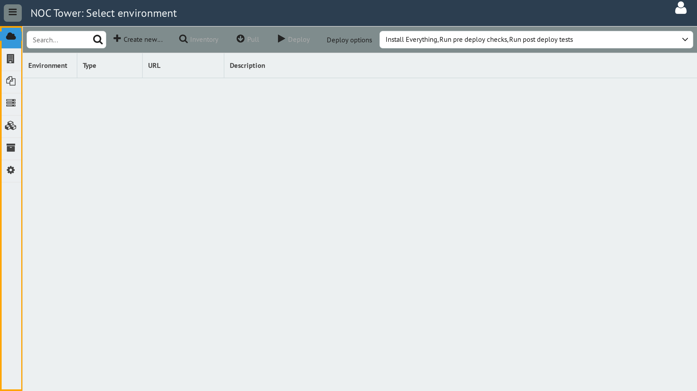

# Main Desktop

After launching the application, you will see the main desktop.

The header is located at the top of the desktop.

The sidebar on the left provides access to the application sections.

The grill button in the top-left corner of the header collapses the sidebar.

When collapsed, the sidebar displays only the section icons.

To expand the sidebar again, click the grill button once more.
