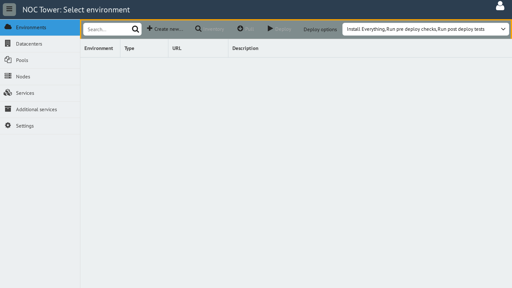
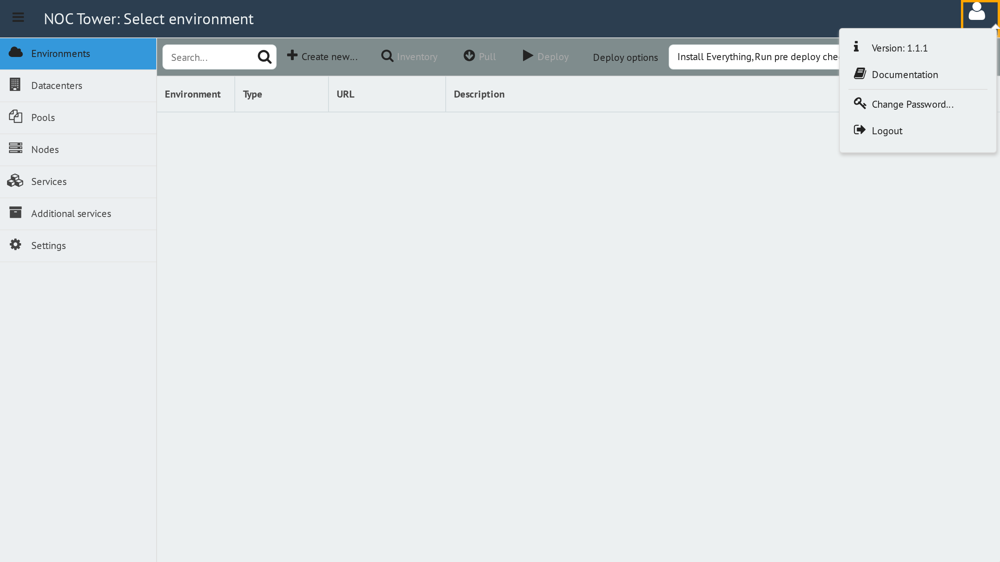

# Main Desktop

After you log in, Tower opens the main desktop. The desktop provides access to all application sections and serves as the main workspace for your daily operations.

## Desktop Composition

The desktop consists of three main areas: the header, the sidebar, and the working area.

### Header

The header is located at the top of the desktop. It provides access to global application controls and user-specific actions.

### Sidebar

The sidebar is located on the left side of the desktop. It provides navigation between the main application sections. Select a section by clicking its corresponding icon.

The grill button in the top-left corner of the header collapses the sidebar.

When the sidebar is collapsed, it displays only the section icons. This provides more space for the working area while keeping the section navigation available.

To expand the sidebar again, click the grill button once more.

### Working Area

The working area occupies the main part of the desktop to the right of the sidebar. It displays the content of the currently selected section.

## User Menu

The user menu provides access to information about the current Tower session and common user actions.

Hover over the user icon in the top-right corner of the header to open the menu.

The user menu contains the following items:

* **Version** — Displays the version of Tower currently running.
* **Documentation** — Opens the Tower documentation in a separate browser tab.
* **Change Password** — Opens the [Change Password](../change-password/index.md) form.
* **Logout** — Ends the current session and redirects you to the [Login screen](../login/index.md).
