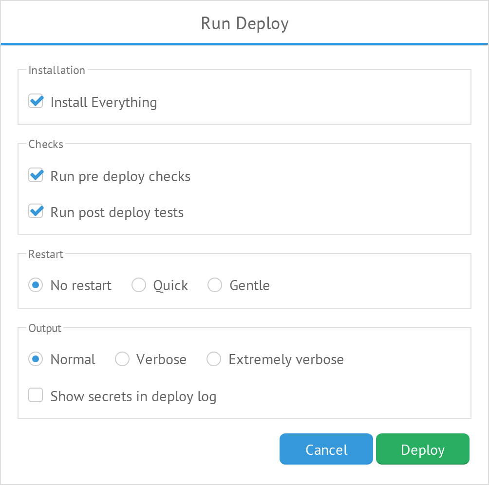
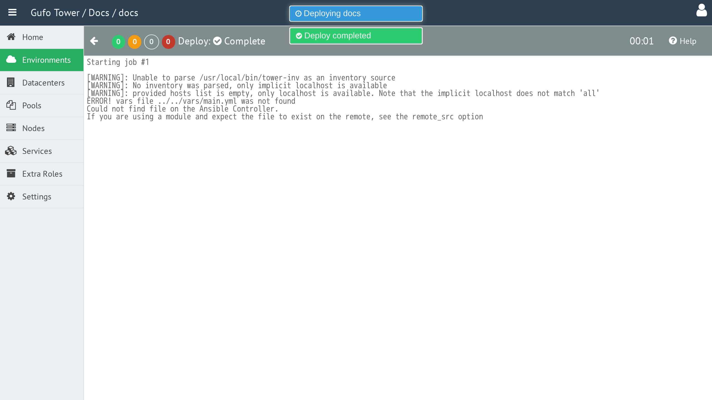

# Deploy

**Deploy** is the process of applying changes to the NOC nodes. It can be used during installation, configuration, and NOC version updates.

To start a deployment, select the required Environment and click the **Deploy** button in the Environment List toolbar.

Clicking **Deploy** opens the [Deploy Configuration Form](#deploy-configuration-form), where the deployment parameters can be configured.

## Deploy Configuration Form

The **Deploy Configuration Form** is displayed when a deployment is started.

The form contains the following options:

### Install Everything

Install all NOC components.

### Run Pre-Deploy Checks

Run additional checks before starting the deployment.

### Run Post-Deploy Tests

Run tests after the deployment is completed.

### Service Restart

Defines how NOC services are restarted during deployment.

| Option | Description |
| --- | --- |
| **No Restart** | Do not restart services. |
| **Quick** | Restart all services simultaneously. |
| **Gentle** | Restart services one at a time. |

### Build Set Output

Defines the level of output generated during the deployment.

| Option | Description |
| --- | --- |
| **Normal** | Normal output. |
| **Verbose** | Increased logging level. |
| **Extremely Verbose** | Debug information. |

### Show Secret in Deploy Log

Show keys and passwords in the deployment log.

> **Warning:** Enabling this option may expose sensitive information in the deployment log.

### Cancel

Cancel the deployment and return to the Environment List.

### Deploy

Start the deployment with the selected configuration.

## Deploy Log

After the deployment configuration is submitted, the Deploy panel displays the deployment progress and results.

## Deploy Toolbar

The toolbar provides controls for managing and monitoring the deployment.

The toolbar contains the following elements:

| Element | Description |
| --- | --- |
| **Back** | Back to the environment list. |
| **Deploy Recap** | Displays a summary of deployment tasks by their result. |
| **Deploy Status** | Displays the current deployment status. |
| **Elapsed Time** | Displays the time elapsed since the deployment started. |
| **Help** | Show this help page. |

## Deploy Recap

**Deploy Recap** provides a summary of the deployment results. Each result is displayed as a number with a colored indicator.

| Result | Description |
| --- | --- |
| 
x
 | Task completed successfully without changes. |
| 
x
 | Task completed successfully with changes. |
| 
x
| Tower could not connect to the host. |
| 
x
 | Task failed. |