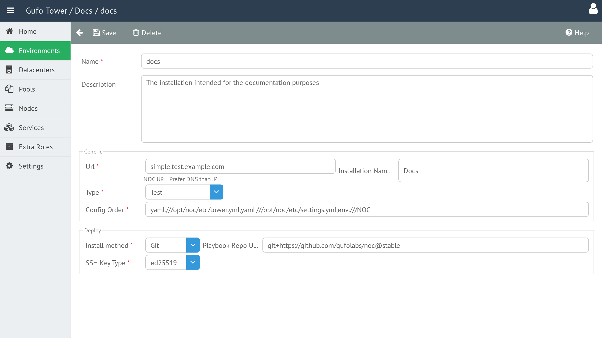

# Environment Form

The **Environment Form** is used to create and edit Environments.

## Name

The Environment name.

The name should be reasonably short and may contain only Latin letters (uppercase or lowercase), digits, and underscores (`_`). The name must be unique among Environments.

## Description

A detailed, human-readable description of the Environment.

## URL

The starting URL of the NOC web application. This is the address at which the NOC installation will be available to users.

## Installation Name

The human-readable name of the NOC installation. It is displayed in the NOC application header.

## Type

The Environment type. See [Environment Types](environment-types.md) for details.

## Config Order

Defines the order in which the NOC configuration is loaded.

For details, refer to the [NOC Configuration System Overview](https://getnoc.com/config-reference/).

## Install Method

Defines the method used to install NOC.

## Playbook Repo URL

The URL of the Git repository from which the Ansible playbooks will be obtained. See [Git Repository URL Format](../../reference/git-repository-url-format.md) for details.

## SSH Key Type

Defines the type of SSH key generated for the Environment and used for deployment.

The following key types are supported:

- **ED25519**
- **RSA**

## Environment Form Toolbar

The toolbar provides actions for managing the current Environment.

| Button | Description |
| --- | --- |
| **Back** | Return to the [Environment List](list.md). |
| **Save** | Save changes to the current Environment. |
| **Delete** | Delete the current Environment. |
