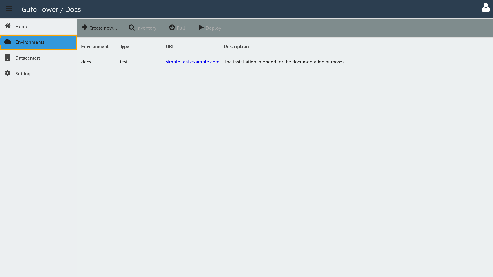

# Environments

An **Environment** represents a separate NOC installation and provides an isolated environment for installing, configuring, and managing NOC.

Gufo Tower can manage multiple NOC installations simultaneously. Each installation is represented by a separate Environment in Gufo Tower.

Each Environment contains the configuration and information required to manage its corresponding NOC installation.

## Accessing Environments

To access Environments, select the **Environments** item in the sidebar.

## Contents

- [Environment List](list.md)
- [Environment Form](form.md)
- [Pull](pull.md)
- [Deploy](deploy.md)
- [Show Inventory](show-inventory.md)
- [Environment Types](environment-types.md)