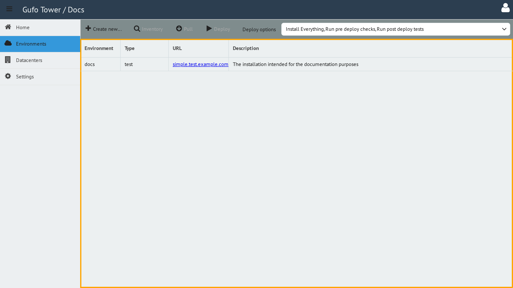

# Working with the Environment List

The **Environment List** displays all [environments](index.md) currently configured in Gufo Tower.

The list contains the following columns:

| Column | Description |
| --- | --- |
| **Environment** | Environment name. |
| **Type** | Environment type. See [Environment Types](environment-types.md) for details. |
| **URL** | Starting page of the NOC web application. Clicking the URL opens the corresponding NOC installation. |
| **Description** | Text description of the environment. |

Clicking an Environment row makes it the **active Environment** for the entire Gufo Tower application.

To view and configure an Environment, double-click the corresponding row in the list to open the [Environment Form](form.md).

A toolbar above the list provides actions for managing Environments.

The toolbar contains the following buttons:

| Button | Description |
| --- | --- |
| **Create New** | Creates a new Environment. |
| **Inventory** | Displays the Ansible inventory file for the selected Environment. Available only when an Environment is selected. See [Show Inventory](show-inventory.md) for details. |
| **Pull** | Pulls the playbooks for the selected Environment. Available only when an Environment is selected. See [Pull](pull.md) for details. |
| **Deploy** | Runs the deployment for the selected Environment. Available only when an Environment is selected. See [Deploy](deploy.md) for details. |
