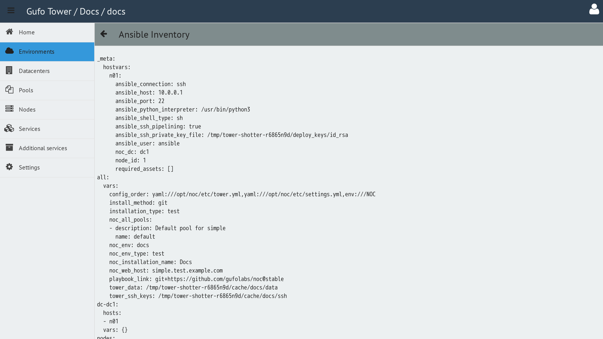

# Show Inventory

The **Show Inventory** operation displays the Ansible inventory for the selected Environment.

The Inventory contains the data used to configure the Ansible deployment. It is useful for diagnostics and development, as it allows you to inspect the data used during deployment.

The **Show Inventory** operation is performed for the currently selected Environment.

To display the Ansible inventory, select the required Environment in the Environment List and click the **Inventory** button in the toolbar.

A new window opens displaying the **Inventory**.

## Inventory Toolbar

The toolbar provides actions for managing the Inventory view.

| Button | Description |
| --- | --- |
| **Back** | Return to the [Environment List](list.md). |
