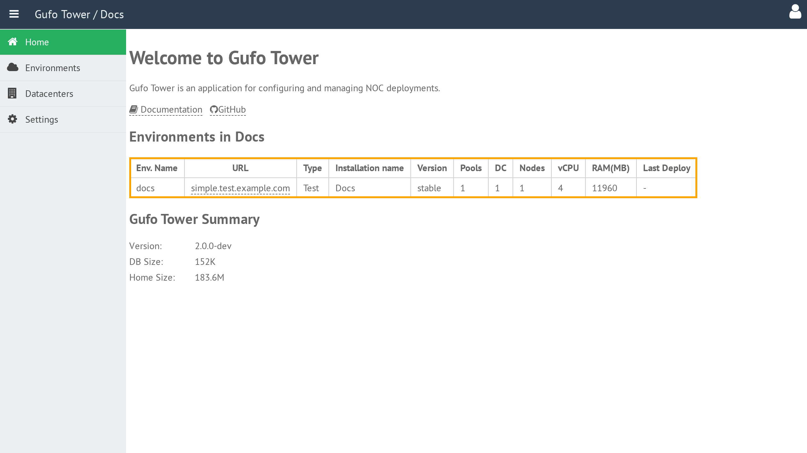
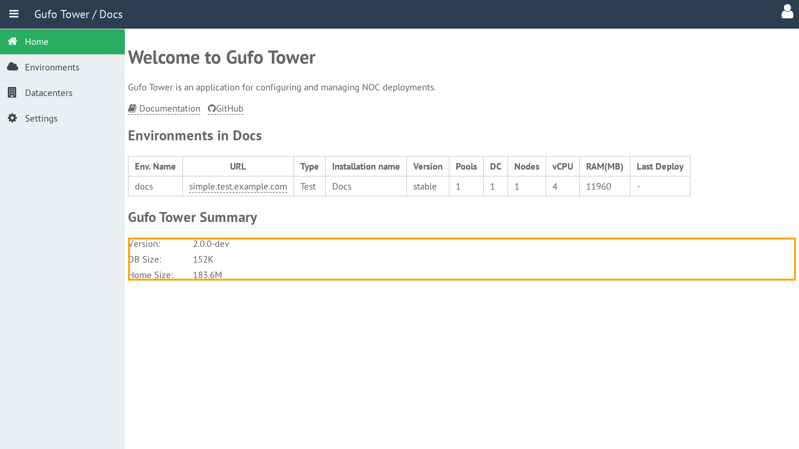

# Home Dashboard

The **Home Dashboard** is the main information screen displayed after launching Gufo Tower.

## Environments Summary

The **Environments Summary** table provides an overview of all environments configured in Gufo Tower.

For more information about environments, refer to the [Environment](../environment/index.md) section of the documentation.

The table contains the following columns:

| Column | Description |
| --- | --- |
| **Env Name** | Environment name. |
| **URL** | Starting URL of the NOC application. Clicking the URL opens the corresponding NOC installation in a new browser tab. |
| **Type** | Installation type. Refer to the [Environment](../environment/index.md) section for details. |
| **Installation Name** | Human-readable installation name displayed in the NOC application header. |
| **Version** | Deployed NOC version, Git branch, or tag. |
| **Pools** | Total number of pools in the environment. Refer to the [Pool](../pool/index.md) section for details. |
| **DC** | Total number of datacenters occupied by the environment. Refer to the [Datacenter](../datacenter/index.md) section for details. |
| **Nodes** | Total number of nodes running the environment. Refer to the [Node](../node/index.md) section for details. |
| **vCPU** | Total number of virtual CPUs allocated to the Environment. |
| **RAM (MB)** | Total amount of RAM, in megabytes, allocated to the Environment. |
| **Last Deploy** | Time and status of the most recent deployment of the Environment. |

## Gufo Tower Summary

The **Gufo Tower Summary** provides an overview of the Gufo Tower installation itself.

The summary contains the following information:

| Field | Description |
| --- | --- |
| **Version** | Version of Gufo Tower. |
| **DB Size** | Size of the Gufo Tower configuration database. |
| **Home Size** | Size of the Gufo Tower home directory. Refer to [Home Directory Structure](../../reference/home-structure.md) for details. |