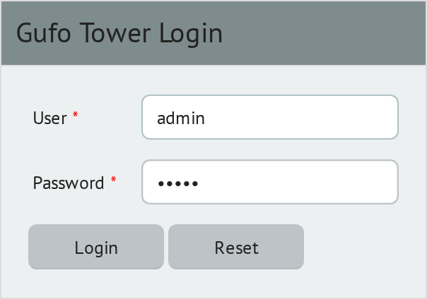

# Login

When an unauthenticated user opens the Gufo Tower web interface, the **Login** form is displayed.

{ width=302 }

To sign in:

1. Enter your username in the **Username** field.
2. Enter your password in the **Password** field.
3. Click Login or press Enter in either field.

For a new installation, use the default credentials:

- **Username:** `admin`
- **Password:** `admin`

After successful authentication, the main Gufo Tower interface is displayed.
