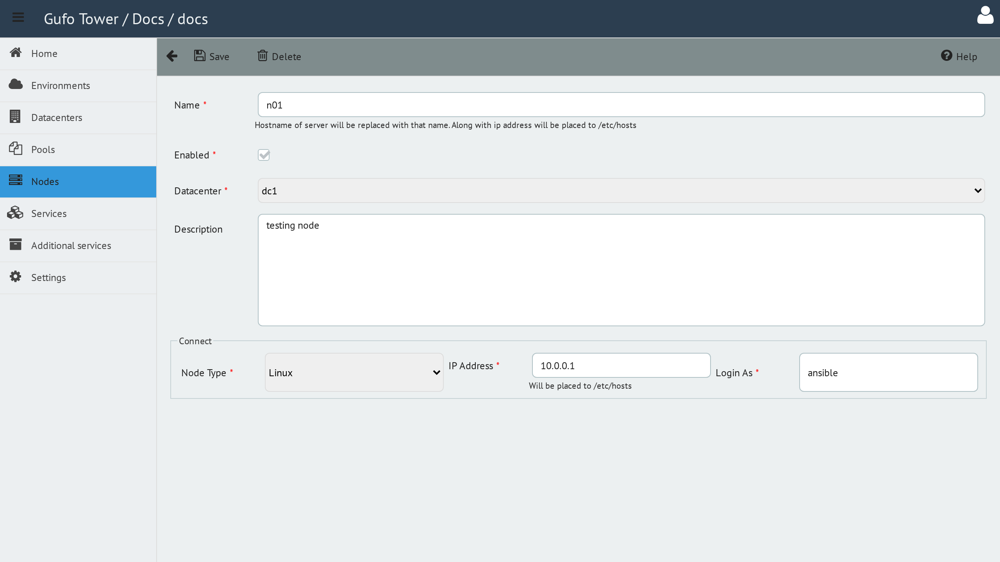

# Node Form

The **Node Form** is used to create and edit Nodes.

## Name

The Node name.

The name must be unique within the Datacenter. Node names are written to the `hosts` file on the hosts.

## Enabled

Enables or disables the Node.

Disabled Nodes are excluded from deployment.

## Datacenter

The Datacenter where the Node is located. See [Datacenters](../datacenter/index.md) for details.

## Description

A detailed, human-readable description of the Node.

## Node Type

The type of the Node. See [Node Types](node-types.md) for details.

## API Address

The IP address used to access the Node.

This address is written to the `hosts` file and is used by Gufo Tower to access the Node for deployment and for communication between Nodes.

## Login User

The user account used by Gufo Tower to access the Node over SSH.

## Node Form Toolbar

The toolbar provides actions for managing the current Node.

| Button | Description |
| --- | --- |
| **Back** | Return to the [Node List](list.md). |
| **Save** | Save changes to the current Node. |
| **Delete** | Delete the current Node. |
| **Help** | Show this help page. |