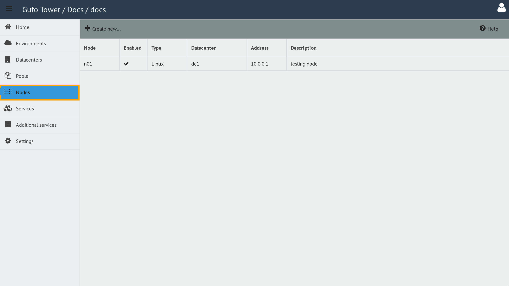

# Nodes

A **Node** represents a physical or virtual machine on which NOC or a part of NOC is deployed.

## Accessing Nodes

Nodes are available only when an Environment is selected.

To access Nodes, first select the required Environment and then select the **Nodes** item in the sidebar.

## Contents

- [Node List](list.md)
- [Node Form](form.md)
- [Node Types](node-types.md)