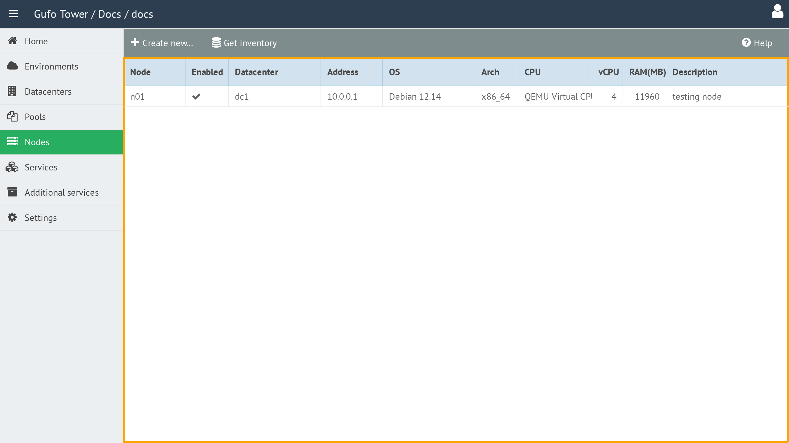

# Working with the Node List

The **Node List** displays all Nodes currently configured for the selected [Environment](../environment/index.md).

The list contains the following columns:

| Column | Description |
| --- | --- |
| **Node** | Node name. The name must be unique within the Datacenter. |
| **Enabled** | Indicates whether the Node is enabled. Deployment is not performed on disabled Nodes. |
| **Datacenter** | Datacenter where the Node is located. See [Datacenters](../datacenter/index.md) for details. |
| **Address** | Management address of the Node. This address is used by Gufo Tower to access the Node for deployment and for communication between Nodes. |
| **OS** | Installed operating system. |
| **Arch** | System architecture, such as `x86-64`. |
| **CPU** | CPU model. |
| **vCPU** | Total number of virtual CPUs allocated to the Node. |
| **RAM (MB)** | Total amount of RAM, in megabytes, allocated to the Node. |
| **Description** | Human-readable description of the Node. |

To view and configure a Node, double-click the corresponding row in the list to open the [Node Form](form.md).

## Toolbar

A toolbar above the list provides actions for managing Nodes.

The toolbar contains the following buttons:

| Button | Description |
| --- | --- |
| **Create New** | Creates a new Node. |
| **Get Inventory** | Runs inventory collection for all Nodes and updates their inventory information. |
| **Help** | Shows this help page. |