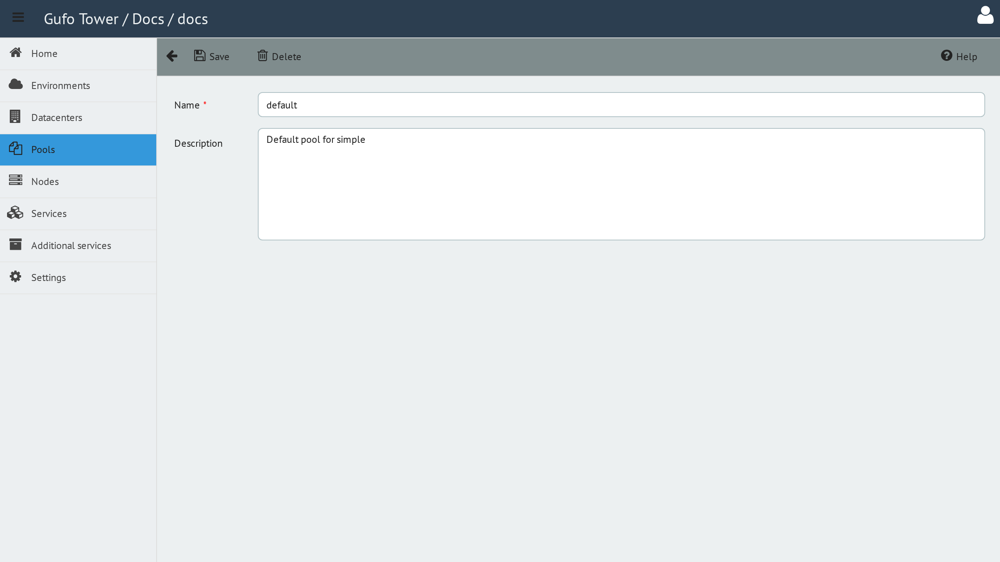

# Pool Form

The **Pool Form** is used to create and edit Pools.

## Name

The Pool name.

The name should be reasonably short and may contain only letters and digits.

## Description

A detailed, human-readable description of the Pool.

## Pool Form Toolbar

The toolbar provides actions for managing the current Pool.

| Button | Description |
| --- | --- |
| **Back** | Return to the [Pool List](list.md). |
| **Save** | Save changes to the current Pool. |
| **Delete** | Delete the current Pool. |
| **Help** | Show this help page. |