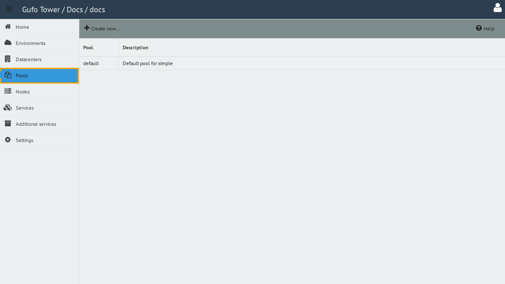

# Pools

A **Pool** is a group of NOC processes dedicated to processing tasks for a specific group of hardware.

Pools provide two important functions. First, they allow the NOC installation to scale by distributing the processing load between multiple groups of processes. Second, they provide isolation of address spaces: address spaces used by different Pools may overlap because the corresponding processes operate in separate address spaces.

## Accessing Pools

Pools are available only when an Environment is selected.

To access Pools, first select the required Environment and then select the **Pools** item in the sidebar.

## Contents

- [Pool List](list.md)
- [Pool Form](form.md)