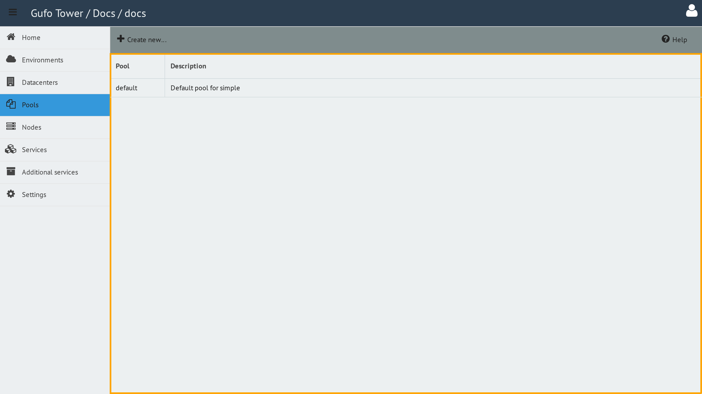

# Working with the Pool List

The **Pool List** displays all Pools currently configured for the selected [Environment](../environment/index.md).

The list contains the following columns:

| Column | Description |
| --- | --- |
| **Pool** | Pool name. |
| **Description** | Text description of the Pool. |

To view and configure a Pool, double-click the corresponding row in the list to open the [Pool Form](form.md).

## Toolbar

A toolbar above the list provides actions for managing Pools.

The toolbar contains the following button:

| Button | Description |
| --- | --- |
| **Create New** | Creates a new Pool. |
| **Help** | Show this help page. |