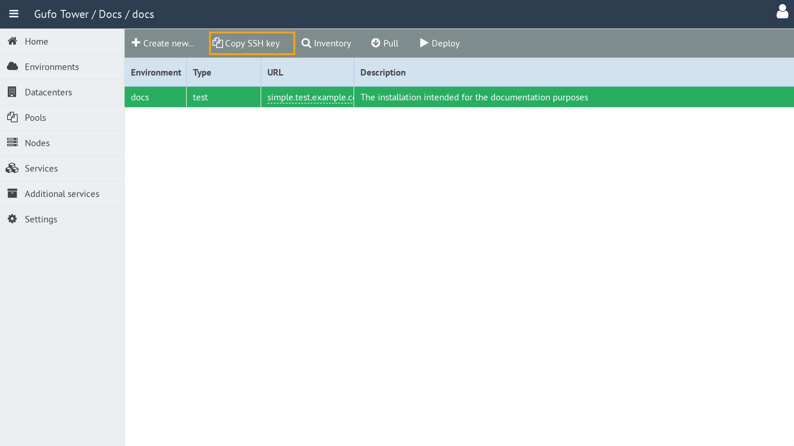
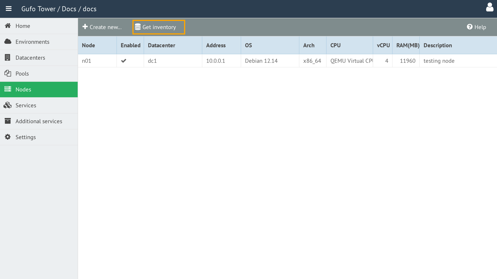
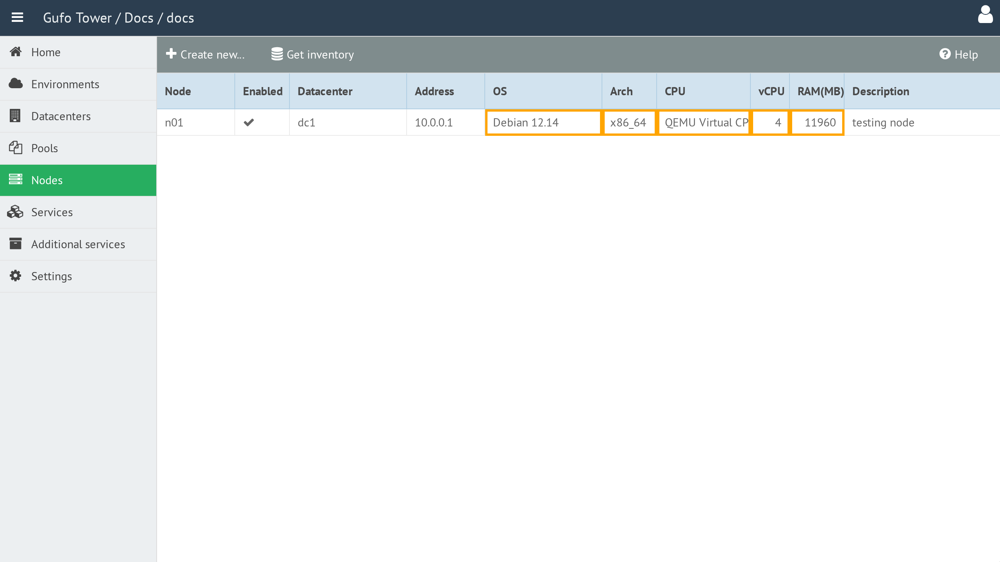

# Preparing Nodes

Before deploying a node, a small amount of preparation is required. **This preparation is performed only once per node. Once a node has been prepared, no additional preparation is required for subsequent deployments or upgrades.**

There are two ways to prepare a node:

* **Manual preparation** — create the deployment user and add the Tower SSH key.
* **Cloud-init** — automatically prepare a virtual machine on its first boot.

## Manual Preparation

Create the deployment user and add it to the `sudo` group (`ansible` for this example):

```shell
useradd -m -s /bin/bash ansible
usermod -aG sudo ansible
```

Allow the user to run `sudo` without a password. Create `/etc/sudoers.d/ansible` with:

```text
ansible ALL=(ALL) NOPASSWD:ALL
```

Add the Tower deployment public key to `/home/ansible/.ssh/authorized_keys`.

If `authorized_keys` does not exist, create it first. **Add** the key to the file; do not replace existing keys.

Set the correct ownership and permissions:

```shell
mkdir -p /home/ansible/.ssh
chmod 700 /home/ansible/.ssh
chmod 600 /home/ansible/.ssh/authorized_keys
chown -R ansible:ansible /home/ansible/.ssh
```

The Tower deployment public key is available in the node configuration interface. Click the **Copy** button next to the key to copy it to the clipboard.



## Cloud-init

Virtual machines can be prepared automatically using cloud-init.

For cloud-init provisioning, use the following URL:

```text
http://<TOWER_IP>:<TOWER_PORT>/cloud-init/
```

Replace `<TOWER_IP>` with the IP address of the Tower and `<TOWER_PORT>` with its web interface port.

When creating the VM, provide this URL as the cloud-init datasource URL. On its first boot, the VM retrieves its configuration from Tower and performs the required initial setup.

### QEMU

For QEMU, pass the Tower cloud-init provisioning URL described above through the SMBIOS serial field:

```shell
qemu-system-x86_64 \
    ... \
    -smbios type=1,serial="ds=nocloud;s=<CLOUD-INIT-URL>"
```

The VM must use a cloud image with cloud-init installed.

## Checking the Node

After preparing the node, add it to Tower.

In the **Nodes** list, click **Get inventory** and wait for the operation to complete.



Tower will retrieve information from the node and update the corresponding fields in the list.


