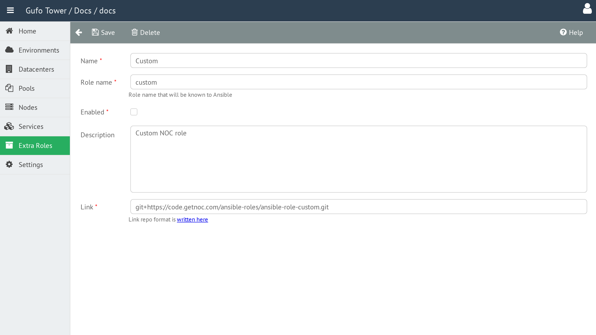

# Extra Role Form

The **Extra Role Form** is used to create and edit Extra Roles.

## Name

The human-readable name of the role.

## Role Name

The machine-readable name of the role used by Ansible during deployment.

## Enabled

Enables or disables the role.

Disabled roles are excluded from deployment.

## Description

A detailed, human-readable description of the role.

## Link

The URL of the Git repository from which the role can be downloaded. See [Git Repository URL Format](../../reference/git-repository-url-format.md) for details.

## Extra Role Form Toolbar

The toolbar provides actions for managing the current Extra Role.

| Button | Description |
| --- | --- |
| **Back** | Return to the [Extra Role List](list.md). |
| **Save** | Save changes to the current Extra Role. |
| **Delete** | Delete the current Extra Role. |
| **Help** | Shows this help page. |