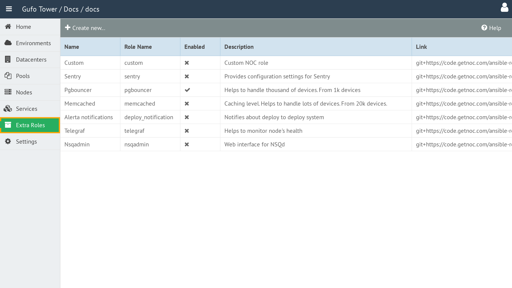

# Extra Roles

An **Extra Role** is an additional Ansible role that is downloaded and executed as part of the NOC deployment.

Extra Roles allow you to perform additional actions during deployment alongside the standard NOC deployment of a Node.

## Accessing Extra Roles

To access Extra Roles, select the **Extra Roles** item in the sidebar.

## Contents

- [Extra Role List](list.md)
- [Extra Role Form](form.md)