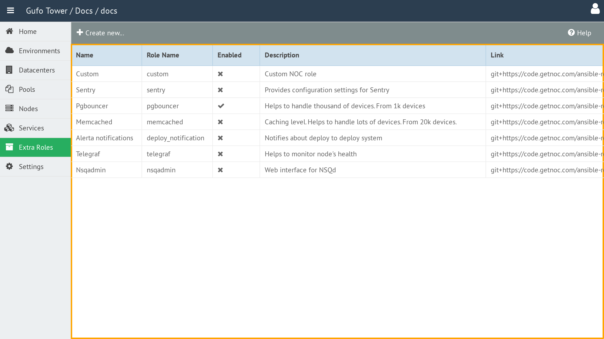

# Working with the Extra Role List

The **Extra Role List** displays all Extra Roles currently configured in Gufo Tower.

The list contains the following columns:

| Column | Description |
| --- | --- |
| **Name** | Human-readable name of the role. |
| **Role Name** | Machine-readable role name used to reference the role during deployment. |
| **Enabled** | Indicates whether the role is enabled. Disabled roles are excluded from deployment. |
| **Description** | Human-readable description of the role. |
| **Link** | Link to the Git repository containing the role. See the repository for details. |

To view and configure an Extra Role, double-click the corresponding row in the list to open the [Extra Role Form](form.md).

## Toolbar

A toolbar above the list provides actions for managing Extra Roles.

The toolbar contains the following buttons:

| Button | Description |
| --- | --- |
| **Create New** | Creates a new Extra Role. |
| **Help** | Shows this help page. |