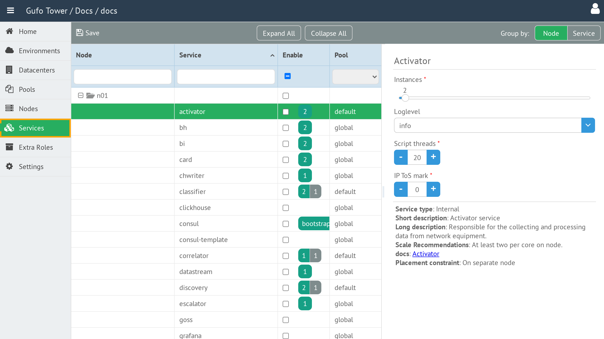
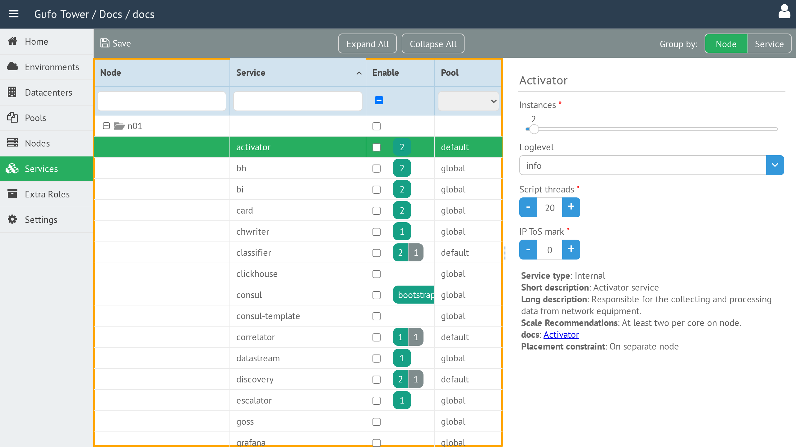
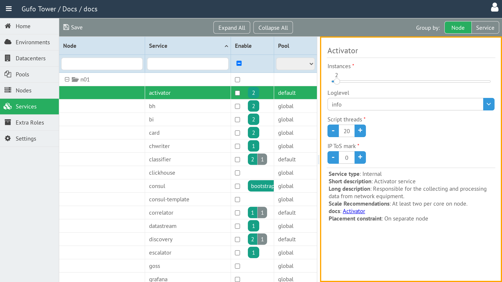

# Services

**Services** are NOC services that will be deployed to Nodes in the selected
[Environment](../environment/index.md). The Services page is a single form for
selecting the services to deploy and configuring their settings.

## Accessing Services

Services are available only when an Environment is selected.

To open the Services page, select the required Environment and then select
**Services** in the sidebar.

## Service List

The left side of the page contains the service tree. By default, it is grouped
by Node, so it shows the services configured on each Node.

Use the **Group by** control to change the view:

| Option | Description |
| --- | --- |
| **Node** | Groups services by Node. |
| **Service** | Groups services by service, making it possible to see the Nodes on which each service is deployed. |

Select a service in the tree to display its settings. The tree also provides
filters for the service and Node columns, an **Enable** control, and a **Pool**
selection.

## Service Settings

Selecting a service displays its parameters on the right side of the page.

The available parameters depend on the selected service. Refer to the linked
NOC documentation shown in the settings panel for the description of each
service and its parameters.

After configuring the required services, select **Save** to save the changes.

## Toolbar

The toolbar provides actions for working with services.

| Button or control | Description |
| --- | --- |
| **Save** | Saves changes to service settings. |
| **Expand All** | Expands all branches of the service tree. |
| **Collapse All** | Collapses all branches of the service tree. |
| **Group by** | Groups the service tree by **Node** or **Service**. |
| **Help** | Shows this help page. |
