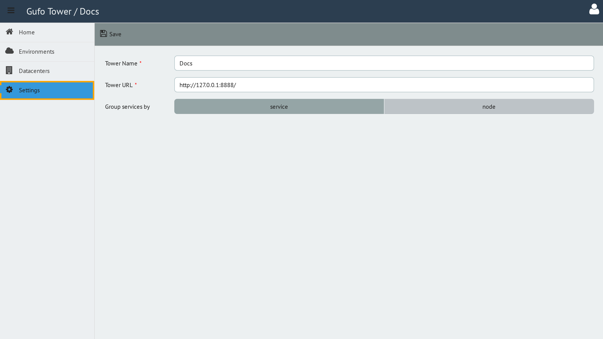

# Settings

The **Settings** page allows you to configure the Gufo Tower installation.

## Accessing Settings

To access Settings, select the **Settings** item in the sidebar.

## Settings Form

The Settings Form contains the configuration parameters for the Gufo Tower installation.

### Tower Name

The name of the Gufo Tower installation. It is displayed in the application header.

### Tower URL

The URL at which the Gufo Tower installation is available.

### Group Services By

Defines how services are grouped in the Gufo Tower interface:

- **Services** — group services by service.
- **Nodes** — group services by node.

## Tower Toolbar

The toolbar provides actions for managing the Gufo Tower settings.

| Button | Description |
| --- | --- |
| **Save** | Save the current settings. |